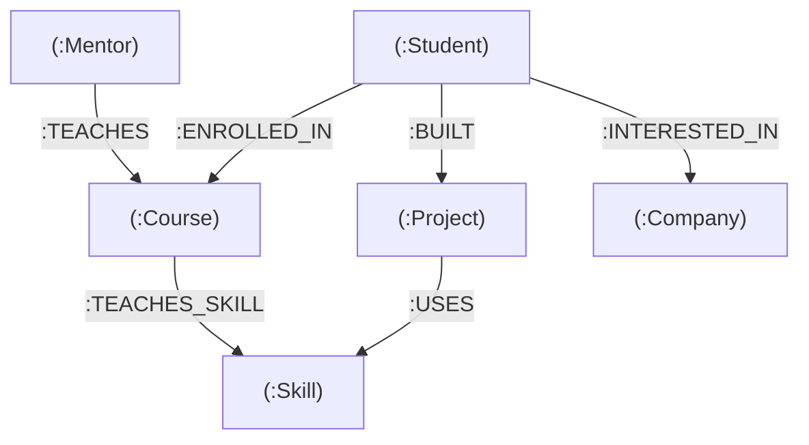
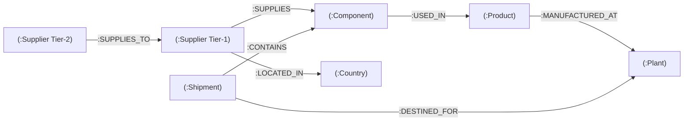

# 🌐 Neo4j Knowledge Graphs Mastery: Portfolio & Project Guide

[](https://www.python.org/)
[](https://neo4j.com/)
[](https://neo4j.com/developer/cypher/)
[]()
[](LICENSE)

Welcome to the **Neo4j Knowledge Graphs Mastery** repository! This repository contains a production-grade portfolio of **7 graph database projects & modules**. It progresses from initial Python-Neo4j driver configuration and enterprise Git workflows to multi-echelon supply chain risk modeling, programmatic Python CRUD engines, multi-hop Cypher traversal algorithms, and an enterprise **Job & Skill Recommendation Engine** capstone.

This document serves as the master blueprint and public showcase for the entire repository, providing comprehensive architectural overviews, graph topology visualizations, code deep dives, quickstart instructions, and presentation talking points.

---

## 📋 Table of Contents

- [🌐 Neo4j Knowledge Graphs Mastery: Portfolio \& Project Guide](#-neo4j-knowledge-graphs-mastery-portfolio--project-guide)
  - [📋 Table of Contents](#-table-of-contents)
  - [💡 Why Knowledge Graphs over Relational Databases (SQL)?](#-why-knowledge-graphs-over-relational-databases-sql)
  - [📁 Repository Architecture & Folder Map](#-repository-architecture--folder-map)
  - [🚀 Module Breakdown \& Deep Dives](#-module-breakdown--deep-dives)
    - [01. Dev Environment \& Driver Connection Verification](#01-dev-environment--driver-connection-verification)
    - [02. Git \& GitHub Developer Workflow](#02-git--github-developer-workflow)
    - [03. First Neo4j Graph: EdTech Platform Knowledge Graph](#03-first-neo4j-graph-edtech-platform-knowledge-graph)
    - [04. Multi-Echelon Supply Chain Risk Knowledge Graph](#04-multi-echelon-supply-chain-risk-knowledge-graph)
    - [05. Programmatic Python Neo4j CRUD Engine](#05-programmatic-python-neo4j-crud-engine)
    - [06. Advanced Graph Traversal \& Multi-Hop Cypher Analytics](#06-advanced-graph-traversal--multi-hop-cypher-analytics)
    - [07. Enterprise Job \& Skill Recommendation Engine (Capstone)](#07-enterprise-job--skill-recommendation-engine-capstone)
  - [📐 Graph Schema Visualizations](#-graph-schema-visualizations)
    - [1. EdTech Knowledge Graph Topology (Module 03)](#1-edtech-knowledge-graph-topology-module-03)
    - [2. Supply Chain Risk Graph Topology (Module 04)](#2-supply-chain-risk-graph-topology-module-04)
    - [3. Enterprise Career & Skill Recommender Topology (Module 07 Capstone)](#3-enterprise-career--skill-recommender-topology-module-07-capstone)
  - [🔍 Featured Cypher Patterns \& Query Highlights](#-featured-cypher-patterns--query-highlights)
  - [⚡ Setup \& Quickstart Guide](#-setup--quickstart-guide)
  - [🎤 Presentation \& Technical Talking Points](#-presentation--technical-talking-points)
  - [📜 License](#-license)

---

## 💡 Why Knowledge Graphs over Relational Databases (SQL)?

When evaluating modern enterprise software architectures, graph databases offer distinct advantages for connected domain models:

1. **Constant-Time Traversals ($O(1)$) vs Exponential Joins ($O(N^k)$)**:
   Traditional RDBMS systems rely on foreign keys and multi-table `JOIN` operations. As query depth increases (e.g., matching a candidate's skills, certifications, peer network, target job requirements, and missing skill courses), SQL engine performance degrades exponentially. Neo4j uses **Index-Free Adjacency**, where nodes store direct memory pointers to connected nodes, making each hop constant-time ($O(1)$) regardless of database size.
2. **Schema Flexibility & Domain Realism**:
   Real-world entities (suppliers, components, skills, candidates, jobs) naturally form networks rather than strict rectangular tables. Property graphs allow seamless schema evolution—adding new node labels or relationship types without destructive schema migrations.
3. **Multi-Hop Traversal Power**:
   Questions like *"If a Tier-2 semiconductor plant in Taiwan faces a regional shutdown, which downstream assembly plants in North America will run out of parts within 14 days?"* are trivial multi-hop Cypher queries (`(t2:Supplier)-[:SUPPLIES_TO]->(t1)-[:SUPPLIES]->(c)-[:USED_IN]->(p)-[:MANUFACTURED_AT]->(pl)`), whereas SQL would require recursive Common Table Expressions (CTEs).

---

## 📁 Repository Architecture & Folder Map

```text
neo4j-knowledge-graphs-mastery/
├── 01-dev-environment-setup/    # Driver initialization & AuraDB connectivity check
├── 02-git-github-workflow/      # Enterprise Git standards & feature branch app
│   └── git-demo-app/           # Hands-on arithmetic app with multi-branch commits
├── 03-first-neo4j-graph/        # EdTech & Learning Platform Knowledge Graph (22 Nodes, 27 Edges)
├── 04-supply-chain-kg/          # Multi-echelon supply chain risk & dependency graph
├── 05-python-neo4j-crud/        # Programmatic Python driver CRUD architecture
├── 06-graph-traversal-queries/  # 10 complex multi-hop Cypher traversal patterns
└── 07-final-kg-project/         # Enterprise Job & Skill Recommendation Capstone (88+ Nodes, 227+ Edges)
```

---

## 🚀 Module Breakdown & Deep Dives

### 01. Dev Environment & Driver Connection Verification
* **Folder**: [`01-dev-environment-setup/`](01-dev-environment-setup)
* **Key Script**: [`01-dev-environment-setup/verify_connection.py`](01-dev-environment-setup/verify_connection.py)
* **Goal**: Establish secure TLS/SSL driver connectivity between Python and Neo4j Aura Cloud DB.
* **Core Features**:
  - Environment variable isolation using `.env` (`NEO4J_URI`, `NEO4J_USERNAME`, `NEO4J_PASSWORD`).
  - Driver verification via `driver.verify_connectivity()`.
  - Exception handling for `AuthError` and `ServiceUnavailable`.
  - Lightweight ping execution (`RETURN 'Neo4j connection active' AS status`).

### 02. Git & GitHub Developer Workflow
* **Folder**: [`02-git-github-workflow/`](02-git-github-workflow)
* **Demo App**: [`02-git-github-workflow/git-demo-app/`](02-git-github-workflow/git-demo-app)
* **Goal**: Establish enterprise Git standards for knowledge graph engineering.
* **Core Features**:
  - Feature-branch workflow (`feature/data-modeling`, `feature/crud-ops`).
  - Strict `.gitignore` definitions preventing credential leakage (`.env`, `venv/`, `__pycache__`).
  - Standardized commit history using Conventional Commits (`feat:`, `fix:`, `chore:`).

### 03. First Neo4j Graph: EdTech Platform Knowledge Graph
* **Folder**: [`03-first-neo4j-graph/`](03-first-neo4j-graph)
* **Key Scripts**: [`03-first-neo4j-graph/cypher/01_seed_graph.cypher`](03-first-neo4j-graph/cypher/01_seed_graph.cypher), [`03-first-neo4j-graph/src/build_graph.py`](03-first-neo4j-graph/src/build_graph.py)
* **Data Volume**: 22 Nodes, 27 Relationships
* **Entities**: `Student`, `Mentor`, `Course`, `Skill`, `Project`, `Company`
* **Core Problem**: Mapping how students enroll in courses, acquire technical skills, build capstone projects, and target hiring companies.
* **Cypher Skills**: Property graph definitions, node labels, directional relationships (`:ENROLLED_IN`, `:TEACHES`, `:BUILT`, `:USES`, `:INTERESTED_IN`), and idempotent `MERGE` statements.

### 04. Multi-Echelon Supply Chain Risk Knowledge Graph
* **Folder**: [`04-supply-chain-kg/`](04-supply-chain-kg)
* **Key Scripts**: [`04-supply-chain-kg/src/build_graph.py`](04-supply-chain-kg/src/build_graph.py), [`04-supply-chain-kg/src/run_queries.py`](04-supply-chain-kg/src/run_queries.py)
* **Entities**: `Supplier`, `Component`, `Product`, `Plant`, `Shipment`, `Country`
* **Business Value**: Multi-tier visibility across Tier-1 and Tier-2 vendors. Allows supply chain managers to perform blast radius disruption queries:
  - *"If a regional lockdown hits Taiwan, which Tier-2 suppliers fail, what components stall, and which downstream assembly plants are affected?"*

### 05. Programmatic Python Neo4j CRUD Engine
* **Folder**: [`05-python-neo4j-crud/`](05-python-neo4j-crud)
* **Key Scripts**: [`05-python-neo4j-crud/connection.py`](05-python-neo4j-crud/connection.py), [`05-python-neo4j-crud/crud_operations.py`](05-python-neo4j-crud/crud_operations.py), [`05-python-neo4j-crud/main.py`](05-python-neo4j-crud/main.py)
* **Architecture**: Object-Oriented Python pattern (`StudentCourseCRUD` class).
* **Key Practices**:
  - Parameterized Cypher queries to eliminate Cypher injection risks.
  - Driver context managers to prevent connection pool leaks.
  - Complete lifecycle methods: `create_student`, `create_course`, `enroll_student`, `find_students_by_city`, `update_student_age`, `remove_enrollment`, `delete_student`.

### 06. Advanced Graph Traversal & Multi-Hop Cypher Analytics
* **Folder**: [`06-graph-traversal-queries/`](06-graph-traversal-queries)
* **Key Scripts**: [`06-graph-traversal-queries/seed_graph.py`](06-graph-traversal-queries/seed_graph.py), [`06-graph-traversal-queries/traversal_queries.py`](06-graph-traversal-queries/traversal_queries.py), [`06-graph-traversal-queries/main.py`](06-graph-traversal-queries/main.py)
* **Query Patterns Mastered (10 Cypher Queries)**:
  1. Single-hop outgoing (`Supplier -> Component`)
  2. Single-hop incoming (`Product <- Component`)
  3. 2-hop traversal (`Supplier -> Component -> Product`)
  4. 4-hop chain (`Supplier -> Component -> Product -> Plant`)
  5. Path property filtering (`lead_time_days >= X`)
  6. Direction-agnostic co-component usage
  7. Fan-out aggregation metrics (`count(DISTINCT p)`)
  8. Variable-length recursive Bill of Materials (`-[:DEPENDS_ON*1..3]->`)
  9. Shortest Path discovery (`shortestPath((s)-[*]-(pl))`)
  10. Path object inspection (`nodes(path)`, `relationships(path)`)

### 07. Enterprise Job & Skill Recommendation Engine (Capstone)
* **Folder**: [`07-final-kg-project/`](07-final-kg-project)
* **Key Scripts**: [`07-final-kg-project/main.py`](07-final-kg-project/main.py), [`07-final-kg-project/src/seed_data.py`](07-final-kg-project/src/seed_data.py), [`07-final-kg-project/src/crud.py`](07-final-kg-project/src/crud.py), [`07-final-kg-project/src/queries.py`](07-final-kg-project/src/queries.py), [`07-final-kg-project/tests/test_crud.py`](07-final-kg-project/tests/test_crud.py)
* **Data Scale**: 88+ Nodes, 227+ Relationships across 6 Node Labels and 7 Relationship Types.
* **Capabilities**:
  - **Schema Constraints**: Uniqueness constraints on Node IDs (`Candidate`, `Skill`, `JobRole`, `Company`, `Certification`, `Course`).
  - **Batch UNWIND Seeding**: High-performance batch data loading using Cypher `UNWIND`.
  - **11 Analytical Queries**: Multi-hop skill gap analysis, 3-hop course & certification recommendations, peer network proximity matching, applicant tracking, and company tech stack footprint.
  - **Interactive CLI & Flags**: Menu-driven terminal interface with CLI flags (`--seed`, `--query`, `--crud`).
  - **Automated Testing**: Unit test suite (`unittest`) asserting CRUD operations and database consistency.

---

## 📐 Graph Schema Visualizations

### 1. EdTech Knowledge Graph Topology (Module 03)



---

### 2. Supply Chain Risk Graph Topology (Module 04)



---

### 3. Enterprise Career & Skill Recommender Topology (Module 07 Capstone)

```mermaid
graph TD
    Cand["(:Candidate)"] -->|:HAS_SKILL {proficiency, years}| Skill["(:Skill)"]
    Cand -->|:APPLIED_TO {status, date}| Job["(:JobRole)"]
    Job -->|:REQUIRES_SKILL {level}| Skill
    Job -->|:POSTED_BY| Comp["(:Company)"]
    Course["(:Course)"] -->|:TEACHES| Skill
    Cert["(:Certification)"] -->|:VALIDATES| Skill
    Cand -->|:EARNED {earned_date}| Cert
```

---

## 🔍 Featured Cypher Patterns & Query Highlights

### 1. Multi-Hop Skill Gap Analysis (2-Hop)
*Identifies mandatory and preferred skills required by a target job role that a candidate lacks:*

```cypher
MATCH (c:Candidate {id: $candidate_id})
MATCH (j:JobRole {id: $job_id})-[:POSTED_BY]->(co:Company)
MATCH (j)-[r:REQUIRES_SKILL]->(s:Skill)
WHERE NOT (c)-[:HAS_SKILL]->(s)
RETURN c.name AS Candidate,
       j.title AS TargetJob,
       co.name AS TargetCompany,
       s.name AS MissingSkill,
       r.level AS RequirementLevel
ORDER BY r.level DESC, s.name ASC
```

### 2. Automated Learning Path Recommendation (3-Hop Traversal)
*Traces 3-hop graph paths to recommend targeted courses and certifications to fill skill gaps:*

```cypher
MATCH (c:Candidate {id: $candidate_id})
MATCH (j:JobRole {id: $job_id})-[:REQUIRES_SKILL]->(s:Skill)
WHERE NOT (c)-[:HAS_SKILL]->(s)
OPTIONAL MATCH (crs:Course)-[:TEACHES]->(s)
OPTIONAL MATCH (crt:Certification)-[:VALIDATES]->(s)
RETURN s.name AS MissingSkill,
       collect(DISTINCT crs.title + ' [' + crs.platform + ']') AS RecommendedCourses,
       collect(DISTINCT crt.title) AS RecommendedCertifications
ORDER BY MissingSkill ASC
```

### 3. Tier-2 Supplier Cascade Risk & Dependency Path
*Finds multi-tier supplier dependencies impacting downstream manufacturing assembly plants:*

```cypher
MATCH (s:Supplier)-[:SUPPLIES]->(c:Component)-[:USED_IN]->(p:Product)-[:MANUFACTURED_AT]->(pl:Plant)
WHERE s.country = $risk_country
RETURN s.name AS RiskSupplier,
       c.name AS AffectedComponent,
       p.name AS AffectedProduct,
       pl.name AS TargetPlant,
       pl.country AS PlantCountry
```

---

## ⚡ Setup & Quickstart Guide

### Prerequisites
- **Python**: Version 3.10 or higher installed.
- **Neo4j DB**: Active Neo4j AuraDB instance (Free or Enterprise) or local Neo4j Desktop / Docker instance.

### 1. Clone & Set Up Environment

```bash
# Clone repository
git clone https://github.com/your-username/neo4j-knowledge-graphs-mastery.git
cd neo4j-knowledge-graphs-mastery

# Create virtual environment
python -m venv venv

# Activate Virtual Environment
# Windows PowerShell:
.\venv\Scripts\activate
# macOS/Linux:
source venv/bin/activate

# Install dependencies for capstone project
pip install -r 07-final-kg-project/requirements.txt
```

### 2. Configure Environment Credentials

Create a `.env` file in `07-final-kg-project/` (or individual module directories):

```env
NEO4J_URI=neo4j+s://<your-aura-instance-id>.databases.neo4j.io
NEO4J_USERNAME=neo4j
NEO4J_PASSWORD=<your-aura-password>
NEO4J_DATABASE=neo4j
```

### 3. Run Projects & Executables

```bash
# 1. Verify Neo4j Aura Connection (Module 01)
python 01-dev-environment-setup/verify_connection.py

# 2. Run EdTech Graph Builder (Module 03)
python 03-first-neo4j-graph/src/build_graph.py

# 3. Run Supply Chain Graph Builder & Risk Queries (Module 04)
python 04-supply-chain-kg/src/build_graph.py
python 04-supply-chain-kg/src/run_queries.py

# 4. Run Programmatic Python CRUD Engine (Module 05)
python 05-python-neo4j-crud/main.py

# 5. Execute 10 Advanced Graph Traversal Queries (Module 06)
python 06-graph-traversal-queries/main.py

# 6. Execute Enterprise Capstone (Interactive CLI) (Module 07)
python 07-final-kg-project/main.py

# Seed Capstone Data directly:
python 07-final-kg-project/main.py --seed

# Run Capstone Analytical Queries:
python 07-final-kg-project/main.py --query

# Run Automated Unit Tests:
python -m unittest discover 07-final-kg-project/tests
```

---

## 🎤 Presentation & Technical Talking Points

Use these concise talking points when presenting this repository to recruiters, hiring managers, or engineering teams:

1. **Graph Database Architecture vs RDBMS**:
   > *"Relational databases require recursive JOIN tables that degrade in performance exponentially ($O(N^k)$) as multi-degree query depth grows. Neo4j uses Index-Free Adjacency with $O(1)$ constant-time pointer traversals per hop, allowing sub-second performance across complex networks."*
2. **Preventing Cypher Injection**:
   > *"All Cypher operations pass dynamic inputs via parameterized dictionary arguments in `session.run()` or `conn.query()`, ensuring user input is never concatenated directly into query strings."*
3. **High-Speed Data Ingestion**:
   > *"Rather than executing single `CREATE` statements sequentially over the network, we utilized Cypher's `UNWIND` clause to pass structured Python payload lists in single atomic transactions."*
4. **End-to-End Enterprise Engineering**:
   > *"The capstone application combines a thread-safe singleton driver connection pool, parameterized CRUD logic, multi-hop analytical queries, an interactive CLI, and automated `unittest` suites."*

---

## 📜 License

This project is open-source and available under the [MIT License](LICENSE). Built as part of the **Euron Super 30 - Neo4j Knowledge Graphs Mastery Track**.
